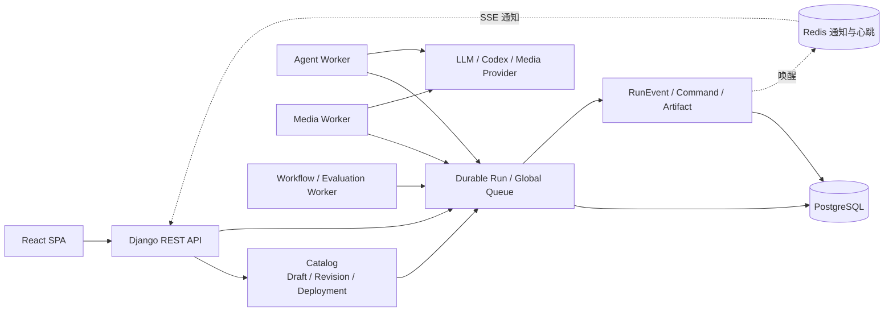

# Agent Studio 当前架构分析

> 分析日期：2026-09-14
>
> 分析方式：只检查当前源码、配置、迁移和可执行测试，没有引用仓库中原有说明文档。
> 迁移策略：项目尚未上线，本轮按破坏性合并处理，不提供旧执行协议兼容层。

## 1. 总体结论

项目目前是“React SPA + Django 模块化单体 + 多执行 Worker”的形态。Web、Scheduler 和 Worker 是独立进程，但共享 Django 领域模型、PostgreSQL 和 Redis。

本轮收敛后只有一套长任务执行模型：`modules.execution.Run`。Application、Agent、Conversation 和 Workflow 都只负责提交 Run；执行状态、重试、交互命令、事件与产物均由 Execution 模块管理。



Redis 只承担通知和进程心跳，不是执行事实源。Run、RunAttempt 和 RunEvent 所在数据库才是可恢复状态的最终来源。

## 2. 唯一领域边界

### 2.1 租户

- `apps.enterprise.Organization` 是唯一组织模型。
- `Membership` 是唯一组织成员和角色来源。
- `modules.tenancy` 只提供组织范围 QuerySet、路径权限和 PostgreSQL RLS 上下文，不再映射或同步另一套租户。
- 请求既可从组织路径读取组织 ID，也可从 `X-Organization-ID` 解析产品 API 的当前组织。
- Conversation 必须属于 Organization；迁移会删除历史上没有组织的本地 Conversation。

### 2.2 Catalog

稳定产品实体仍是：

| 实体 | 稳定身份 | 版本生命周期 |
| --- | --- | --- |
| Agent | `apps.agents.Agent` | AgentDraft → AgentRevision → AgentDeployment |
| Skill | `apps.applications.Skill` | SkillDraft → SkillRevision → SkillDeployment |
| Application | `apps.applications.Application` | ApplicationDraft → ApplicationRevision → ApplicationDeployment |

`modules.catalog` 不复制产品实体；三类定义的草稿、不可变修订及环境部署保存在该模块。Revision 内容以规范 JSON hash 去重，并受应用层校验和数据库触发器双重不可变保护。Skill 创建时原子初始化 Draft，发布按内容 hash 幂等，环境切换和回滚使用乐观版本。

Application 写入只有组织级 Catalog API：

```text
/api/v1/organizations/{organization_id}/applications...
```

`/api/v1/apps/` 只保留只读发现和少量非 CRUD 工具能力，不再创建、修改或删除 Application，也不再从 Application 主表向 Draft 单向同步。运行定义的唯一可变来源是 Draft，唯一可执行来源是 Deployment 指向的 Revision。

### 2.3 Execution

| 模型 | 职责 |
| --- | --- |
| Run | 逻辑执行、定义快照、输入、输出摘要和最终状态；Workflow 节点通过 parent/node_key 形成子 Run |
| RunAttempt | 一次实际尝试及 Worker Pool |
| RunLease | 带 token/epoch 的租约和 fencing |
| RunEvent | Run 内严格递增、可重放的事实事件 |
| RunEventSnapshot | 事件压缩后的客户端投影 |
| RunCommand | answer、permission、cancel 等幂等命令 |
| RunArtifact | 产物元数据、hash 和受控访问 |
| IdempotencyRecord | Application、Agent、Workflow 启动去重 |
| RunQueueEntry | 不受租户 RLS 限制的最小全局调度索引；只保存领取所需字段，真实 Run 仍受 RLS 保护 |

Run 的主要状态机为：

```text
queued → running → succeeded
             ├──→ failed
             ├──→ waiting_input → queued
             ├──→ waiting_children → queued
             └──→ cancelling → cancelled
```

状态变化和事件追加处于同一事务。Worker 写入必须携带当前 Lease fencing token；租约过期的旧进程无法污染新 Attempt。

## 3. 唯一执行路径

### Application

1. 客户端向组织级 Application Run API 提交输入和 `Idempotency-Key`。
2. 服务端读取指定环境 Deployment，冻结 Application Revision、已部署 Skill Revision、依赖和有效配置；任何 Skill 缺少对应环境 Deployment 都会拒绝启动。
3. JSON Schema 校验输入后创建 Run。
4. 对应 Worker Pool 领取 Run，在隔离子进程中执行白名单 adapter。
5. 客户端通过统一 RunEvent SSE 查看输出、进度、工具和产物。

### Agent 与 Conversation

- `AgentExecution` 已删除。
- `AgentSessionRegistry`、adapter `create_session`、旧 AgentEvent 和 Codex 风格协议投影已删除。
- `/api/agent/v2/` 已删除。
- Agent execute 是创建 durable Run 的薄入口，历史也是 Run 列表。
- Conversation 只保存会话、消息和工作区绑定；`send_message` 创建 Agent Run。
- Conversation 不再提供第二套 stream/resume/cancel 路由。前端拿到 Run 后直接使用统一 Run SSE 和 RunCommand API。
- Run 结束后通过投影服务创建 assistant Message；Message 以 OneToOne `run` 外键保证并发幂等，不依赖 JSON 查询去重。

### Workflow

- `WorkflowRun` 和 `WorkflowStepRun` 已删除。
- 手工 `select-step/complete-step` 状态机已删除。
- Workflow 启动时冻结每一步的 Application Deployment Revision、依赖、条件和重试策略，创建一个 `workflow/workflow-dag` Run。
- DAG 使用稳定 step key 描述依赖；重复 key、未知依赖和循环依赖均在执行前拒绝。
- 每个可执行节点创建或复用一个 durable child Run，由对应 Agent/Media Worker 独立领取；Workflow Worker 只负责拓扑编排和聚合。根 Attempt 等待子节点时持久化 checkpoint 并进入 `waiting_children`，立即释放子进程槽位。
- 节点支持独立 `max_attempts`、基于输入或依赖输出的条件分支，并产生 `workflow.step.*` RunEvent。子 Run 完成或需要输入时，通过父子关系事件唤醒根 Run；根 Worker 重启后复用已有 child Run，不重复启动已完成节点。
- 子 Run 的 waiting_input 会挂起根 Run；恢复命令转发到对应子 Run。用户取消根 Run 时，取消命令向仍活跃的子 Run 传播。
- 步骤状态通过统一 RunEvent 投影展示；历史和详情读取通用 Run API。
- Workflow 启动使用请求幂等键，防止重复创建。

### Media

批量转录通过 `media/batch-transcribe` adapter 执行，直接使用 `faster-whisper`，不再经过旧 `creation_core` 翻译层。目录在浏览接口和子进程 adapter 两处校验允许根路径。转录结果通过统一 Artifact 消息交给 Coordinator 原子落盘、计算 SHA-256 并登记 `RunArtifact`，不再只返回 Worker 本地路径。

## 4. 前端架构

前端运行态只有以下链路：

```text
Page / Store
    → organization-scoped Run REST API
    → services/runStream
    → entities/run sequencer + reducer
    → RunEvent projection
```

所有 REST 请求只从 `services/api.ts` 进入，`axios.ts` 是不对业务代码暴露的传输实现。路由页面全部使用动态 import，第三方依赖按 React、Ant Design 组件、Markdown 和公共库拆包。

后端 Swagger 2 契约先规范转换为 OpenAPI 3，再由 `openapi-typescript` 生成 `src/api/generated.ts`；页面类型可以直接引用生成的 schema。Run 流式场景收敛在 `features/run-stream` feature slice，事实投影仍由 `entities/run` 独立维护。

已经删除：

- 旧 Agent Protocol reducer 和独立 Conversation SSE parser。
- 旧 `/apps/:id/run` 页面及 Chat/Image/Batch 多 renderer 运行实现。
- Workflow 的手工步骤运行页和旧运行类型。
- `AgentExecution` 前端类型。
- 独立扫描和编辑 Codex/GraphFlow 文件夹的 Runtime Skill API；技能页现在只操作数据库 Skill Catalog。

Application 只保留 `/applications/:applicationId/run` durable 页面；Workflow Run 使用 `/runs/:runId` 通用详情页。事件缺口、断线重连和历史压缩恢复都由同一个 `runStream` 客户端处理。

Conversation Store 复用 `entities/run` 的 sequencer、reducer 和 snapshot 恢复逻辑，只保留聊天消息投影副作用。后端与前端使用 `contracts/run-events-v1.json` 作为同一组事件投影契约测试输入，防止两端 reducer 漂移。

## 5. 权限与隔离

- 组织路径、资源 Organization 和 Membership 必须一致。
- Application、Agent、Skill 的写操作校验组织角色；删除要求 Owner/Admin。
- PostgreSQL Catalog 和 Execution 租户表启用并强制 RLS。
- Agent、Application、Skill、Project、Conversation、Workflow、Template 及其租户子表也启用并强制 RLS；全局/已发布内容只允许跨租户读取，写策略仍严格限制为当前租户。Project 的 Organization 已改为必填，迁移会为历史记录回填工作区。
- Scheduler、HTTP 请求与 Execution Worker 在访问上述表前均设置数据库租户上下文。
- 生产 Compose 使用独立应用数据库账号，显式设置 `NOSUPERUSER` 和 `NOBYPASSRLS`；管理员账号只用于初始化数据库。
- Revision 只能选择服务端注册的 executor key，不能通过 JSON 注入 Python import path。
- Artifact 使用短期签名访问，且本地 object key 必须位于配置根目录。
- Run 入队时执行并冻结配额、模型 allowlist、Skill allow/block、递归输入脱敏/禁词策略；成功输出在落库前再次执行递归 guardrail。需要人工批准工具调用时，策略会传递到 Codex/GraphFlow adapter。
- 共享模块对产品 App 的依赖由 AST 架构测试形成可执行白名单；新增跨边界 import 必须显式评审。
- 所有产品路由只允许出现在 `/api/v1` 下；架构测试阻止非版本化产品入口重新出现。
- 浏览器只在内存保存 access token，refresh token 仅通过 `HttpOnly`、`SameSite=Strict` Cookie 轮换；SSE 与普通 REST 共用单次刷新协调器并从原 sequence 恢复。

## 6. 部署与可观测性

生产编排包含：

| 进程 | 职责 |
| --- | --- |
| web | Django ASGI、REST、SSE |
| migrate | 启动前一次性执行数据库迁移 |
| agent-worker | Agent Run |
| media-worker | Media Run |
| workflow-worker | Workflow Run |
| evaluation-worker | Evaluation 根 Run、真实目标 Revision 的 Case 子 Run 编排与质量评分 |
| scheduler | 自动化触发 |
| maintenance | Retention 删除、RunEvent 压缩和维护心跳 |
| postgres | 领域状态和执行事实源 |
| redis | 通知、缓存和心跳 |

Coordinator 每 5 秒写入 Worker Pool 心跳，Scheduler 和 Maintenance 也写入带 TTL 的心跳。`/readyz/` 在生产配置下同时校验数据库、Redis、四个 Worker Pool 和 Scheduler；Compose 对每个后台进程也配置了心跳健康检查。

Artifact 通过存储端口写入 Local 或 S3/MinIO；Local Compose 仍使用共享 `runtime_data:/data`，多机部署使用对象存储和原生预签名 URL。Maintenance 周期性按组织策略清理旧数据、过期幂等记录和终态 Run，数据库删除成功后才删除对应对象；保留的旧 RunEvent 会压缩为可恢复快照。Web 不再在启动命令中并发执行迁移，而是等待唯一的 `migrate` 服务成功；数据库与 Redis 仅在 Compose 内网开放。

Worker 从 `RunQueueEntry` 按优先级和入队时间全局领取；PostgreSQL 使用 `skip_locked` 支持多 Coordinator 并发。领取索引后才进入对应租户数据库上下文并锁定真实 Run，租约和 fencing 仍是最终一致性保护。

OpenTelemetry 为可选能力。启用后 Django HTTP 请求自动埋点，Run 创建和 Attempt 生命周期产生带 organization/run/attempt/executor 关联属性的 span，并通过 OTLP gRPC 导出。

Evaluation API 会创建 `evaluation/evaluation-suite` durable Run，并将指定 Agent/Application Revision 固定在快照。Evaluation Worker 为每个 Case 创建真实目标子 Run，全部完成后执行确定性 evaluator。存在非空质量门禁的套件时，production Deployment 必须找到该 Revision 最近一次通过的 EvaluationRun。

Scheduler 逐条使用 `select_for_update` 领取定时触发器，并用“触发器 ID + 分钟时间桶”作为 Run 幂等键，多 Scheduler 副本不会为同一时刻重复创建 Run。

审计中间件会限制请求 ID 和字段长度、校验来源 IP，并在独立数据库保存点中写入 AuditLog。即使审计存储异常，也不会污染外围事务、造成接口返回成功但业务写入被回滚。

## 7. 破坏性迁移影响

本轮不保留旧兼容层：

- 删除 AgentExecution、Agent Thread/Turn/Item/ServerRequest、WorkflowRun/WorkflowStepRun 表。
- 删除无 Organization 的历史 Conversation，再把 Organization 改为必填。
- 删除旧 API、旧前端路由、旧事件协议和旧运行组件。
- 删除旧 V2 设计稿；README 和本文只描述当前唯一实现。
- PostgreSQL 初始化变量发生变化：需要提供 `DB_ADMIN_PASSWORD`；`DB_USER/DB_PASSWORD/DB_NAME` 用于创建非特权应用账号和数据库。

现有开发数据库建议从空库重新执行迁移；已有 Compose volume 需要重建，初始化脚本才会生效。

## 8. 当前约束

本轮已按风险和依赖顺序完成核心演进，没有保留旧执行实现。以下是仍然存在的明确边界：

1. Django 是模块化单体，Catalog、Execution、Tenancy 与产品 App 仍有少量必要集成边；这些边已由架构测试精确锁定，但还不是可独立部署的服务边界。
2. SQLite 只用于单进程本地开发和测试；多 Worker、RLS、`skip_locked` 与生产一致性验证必须使用 PostgreSQL。生产配置默认且仅支持 PostgreSQL 部署形态。
3. GraphFlow 只有在其 SDK 返回 `input_request`/`pending_question` 时才能进入 durable suspend；SDK 本身不暴露交互请求时，平台无法从最终 completion 反向推断问题。
4. OpenTelemetry 当前覆盖 Django HTTP、Run 创建和 Attempt 生命周期；Provider 细分 span 与 metrics 尚可继续扩充。
5. Evaluation 当前支持 Agent/Application 作为可执行目标；Skill 的质量验证仍需由外部评测或后续静态 Skill evaluator 产生通过记录。
6. 生成契约仍源自 drf-yasg 的 Swagger 2，因此生成流程包含一次确定性的 OpenAPI 3 转换；后续可直接迁移到原生 OpenAPI 3 schema provider。

## 9. 本轮落地顺序

1. 先统一依赖版本和 CI 基线。
2. 再实现 Workflow 事件唤醒、全局 Run Queue 与 Artifact 存储端口，消除扩展瓶颈。
3. 随后通过 Catalog/Execution ports 收紧模块依赖方向。
4. 在稳定执行基础上完成 Skill 生命周期和 Run Skill Revision 快照。
5. 最后接入 OpenTelemetry、真实 Evaluation 质量门禁以及前端 feature/OpenAPI 契约生成。

## 10. 验证结果

- Django system check：通过。
- `makemigrations --check --dry-run`：无遗漏模型变化。
- 后端与前端测试数字以当前 CI 运行结果为准，避免在文档中保存会过期的快照。
- TypeScript 与 Vite 生产构建：通过。
- 前端已按页面和第三方组件拆包。
- CI 使用 PostgreSQL 16 和 Redis 7.4 运行 Django check、迁移检查、迁移与后端全量测试，并独立校验前端生成类型、lint、test 和生产 build。
