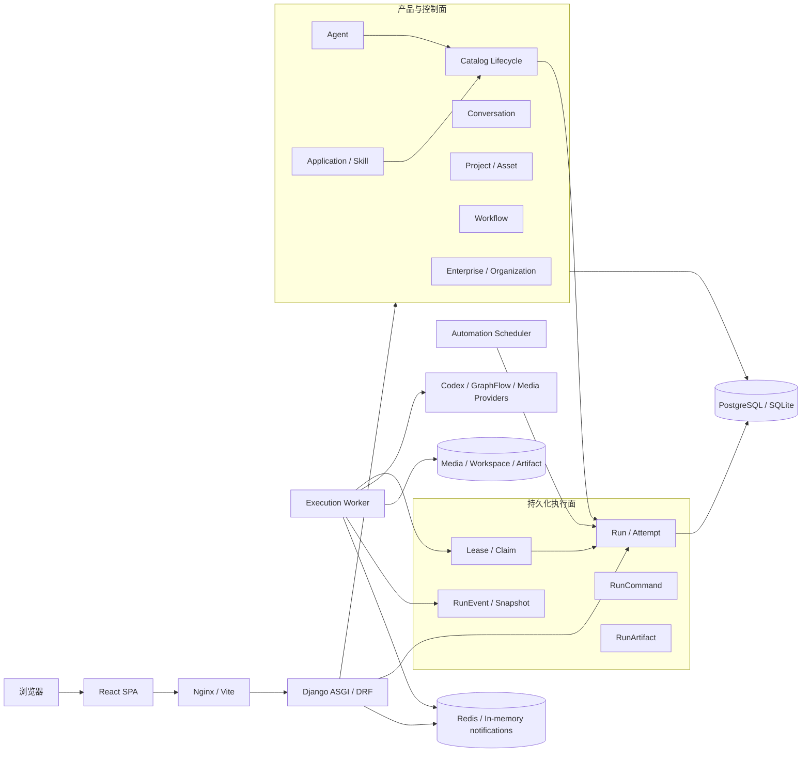
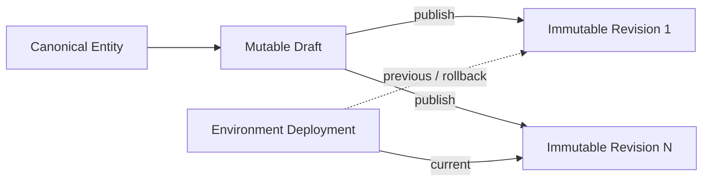
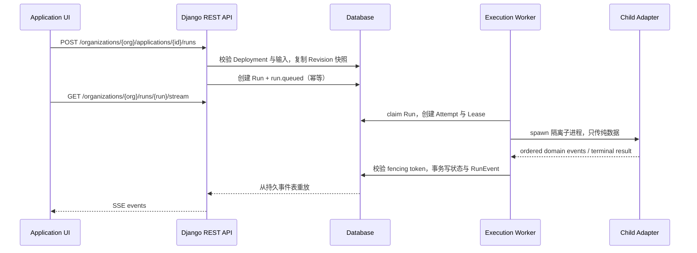
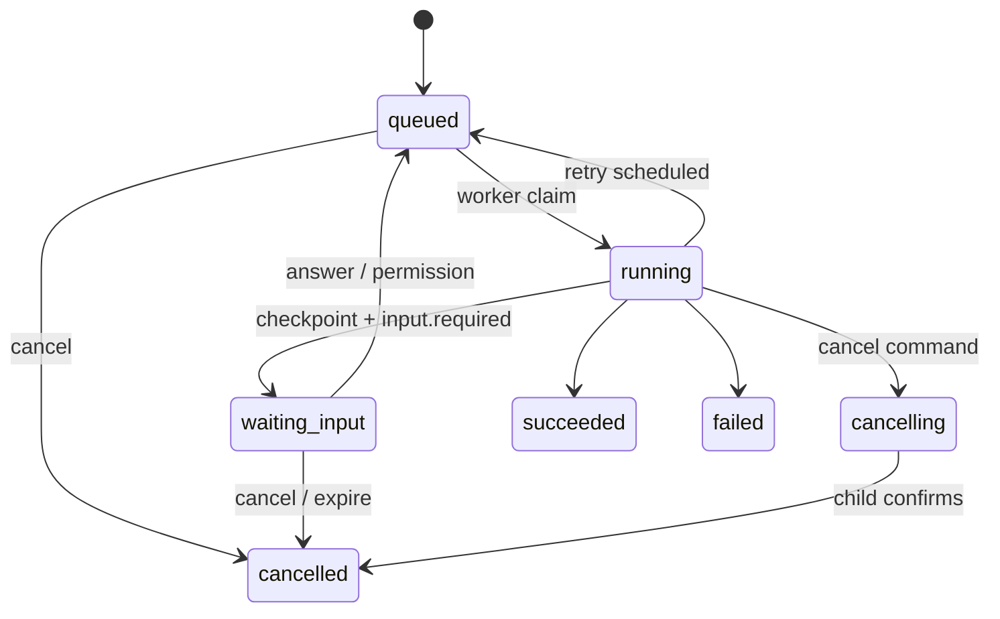

# Creation Agent Studio 架构分析

> 分析日期：2026-09-11
> 分析依据：仅检查当前源码、配置、数据库迁移和自动化测试；未以仓库内已有说明文档作为信息来源。
> 架构状态：原先并行的两套租户、目录和应用执行模型已进行破坏性合并。

## 1. 总体结论

Creation Agent Studio 是一个面向 AI 内容创作的全栈平台，整体采用“React 单页应用 + Django 模块化单体 + 独立后台进程”的架构。

合并后的核心边界如下：

- `apps.enterprise.Organization` 和 `Membership` 是唯一租户身份来源。
- `apps.agents.Agent`、`apps.applications.Skill`、`Application` 是唯一产品实体。
- `modules.catalog` 不再维护第二套 Agent、Skill、Application，只为产品实体提供 Draft、不可变 Revision 和按环境 Deployment。
- 长任务统一落入 `modules.execution.Run`，通过 Attempt、Lease、Event、Command、Artifact 组成持久化执行面。
- 旧 `app_runner.Job/JobEvent`、WebSocket 消费端和独立 Job Worker 已移除；批量转录和 Application 自动化触发均使用 Run。
- 对外的版本化目录和执行接口统一位于 `/api/organizations/{organization_id}/...`，不再使用产品代际路径。

系统仍是模块化单体，而不是微服务。Web、执行 Worker 和 Scheduler 是不同进程，但共享同一套 Django 模型和数据库。

## 2. 系统全景



Redis/Channel Layer 在持久化 Run 中只负责通知，不是事实源。数据库中的 Run 和 RunEvent 才是执行状态与客户端恢复的最终依据。

## 3. 代码组织与职责

| 目录 | 当前职责 |
| --- | --- |
| `frontend/src/pages` | 页面编排及各类 Application renderer |
| `frontend/src/components` | Chat、Application、Workspace 等复合组件 |
| `frontend/src/stores` | 用户、组织、Agent、Application、Project 等客户端状态 |
| `frontend/src/entities/run` | RunEvent 类型、顺序校验和纯状态归约 |
| `frontend/src/services` | REST、SSE 和外部服务客户端 |
| `backend/apps` | 产品业务域和企业控制面 |
| `backend/modules/tenancy` | 统一组织查询、路径权限和 PostgreSQL 租户上下文工具 |
| `backend/modules/catalog` | Draft、Revision、Deployment 生命周期 |
| `backend/modules/execution` | 持久化执行状态机、API、调度基础设施和子进程 Runtime |
| `backend/core` | Agent adapter、Provider、权限、限流、健康检查等横切能力 |

后端依赖方向可概括为：

```text
HTTP API / Product Serializer
            ↓
Application Service（发布、部署、启动、命令、状态转换）
            ↓
Domain Model（Product Entity + Revision + Run）
            ↑
Infrastructure（claim、lease、event notification、artifact）
            ↓
Isolated Child Adapter / External Provider
```

## 4. 统一后的领域模型

### 4.1 唯一租户聚合根

`apps.enterprise.Organization` 使用 UUID 主键，`Membership` 保存用户在组织内的角色和启用状态。Agent、Skill、Application、Run 以及治理资源都直接引用这一 Organization。

`modules.tenancy` 现在只提供：

- `TenantOwnedModel`：为租户资源增加显式 Organization 外键。
- `TenantOwnedQuerySet.for_organization()`：统一组织范围查询。
- 路径组织权限：从 URL 解析 Organization，并校验 Membership。
- PostgreSQL 请求上下文：在事务中设置 `app.organization_id`，供 RLS 使用。

不存在组织 ID 映射、双写或同步问题；前端组织 Store 返回的 UUID 可直接用于目录和 Run API。

### 4.2 唯一产品实体

稳定产品身份仍位于原业务 App：

| 实体 | 位置 | 作用 |
| --- | --- | --- |
| Agent | `apps.agents.Agent` | 当前可编辑 Agent 配置、模型、工具、技能和治理参数 |
| Skill | `apps.applications.Skill` | Skill 元数据、来源、Manifest 和启停状态 |
| Application | `apps.applications.Application` | 应用目录身份、renderer、executor 及输入输出契约 |

`modules.catalog` 直接外键引用这些实体，不再创建重复的目录实体。产品 CRUD 保持现有页面和主键稳定，同时获得统一版本治理能力。

### 4.3 Draft → Revision → Deployment

Agent、Skill、Application 共用同一种生命周期：



主要不变量：

- Organization 内 slug 唯一。
- 每个实体只有一个可变 Draft。
- Draft 使用 version 做 compare-and-swap，防止并发覆盖。
- Revision 使用规范化 JSON 的 SHA-256 去重。
- Revision 在模型层和 PostgreSQL 触发器层禁止更新、删除。
- Deployment 在每个 environment 下唯一，明确指向一个 Revision。
- Deployment 保存 previous revision 和 version，支持原子切换、冲突检测和回滚。

产品侧编辑 Agent/Application 时会同步对应 Draft，因此不再需要维护两个内容来源。发布动作从 Draft 生成 Revision，运行时只读取已部署 Revision。

## 5. Application 运行架构

Application 将“界面”和“执行”分开描述：

- `renderer_key` 决定前端呈现 Chat、图像生成、批量转录或其他专用界面。
- `executor_key` 决定持久化 Worker 加载哪个服务端执行适配器。
- Application Revision 固化 executor kind/key、协议版本、renderer、输入输出 Schema、默认配置和重试策略。

通用长任务启动流程：



批量转录已经使用此链路。页面通过 Run API 启动，使用 SSE 呈现进度、单文件状态和日志，并通过持久化 RunCommand 取消任务。服务端目录浏览仍受 `APPLICATION_RUNTIME_ALLOWED_ROOTS` 白名单限制；执行适配器会再次校验输入目录，避免绕过浏览接口读取任意路径。

## 6. 持久化执行内核

### 6.1 核心实体

| 实体 | 职责 |
| --- | --- |
| Run | 一次逻辑执行，保存定义快照、输入、状态、版本和输出摘要 |
| RunAttempt | 一次实际尝试，支持重试和交互恢复 |
| RunLease | Worker 对 Attempt 的限时所有权，token + epoch 构成 fencing token |
| RunEvent | 单个 Run 内严格递增、可重放的事实事件 |
| RunEventSnapshot | 压缩旧事件后保留的客户端投影和游标 |
| RunCommand | answer、grant/deny permission、cancel 等幂等外部命令 |
| RunArtifact | 产物 metadata、object key、hash 和内容访问入口 |
| IdempotencyRecord | 对 Run 创建等操作进行请求指纹去重 |

### 6.2 状态机



状态变化与 RunEvent 追加在同一数据库事务内完成。SQLite 使用 version/CAS 保护更新；PostgreSQL 额外使用行锁和 `skip_locked` 领取。Lease 过期后，旧 Worker 即使继续运行，也无法用失效 token/epoch 写入新的执行尝试。

### 6.3 SSE 恢复语义

客户端维护下一个期望 sequence：

- 重复事件被忽略。
- 乱序事件先缓冲。
- 发现缺口时通过 REST events 接口补齐。
- 连接中断后从最后 sequence 重新订阅。
- 历史被压缩时先加载 RunEventSnapshot，再从快照游标继续。

服务端采用“先订阅通知、再读取数据库”的顺序，避免订阅窗口丢事件。Redis 不可用或本地未启用时，可退化为数据库轮询。

## 7. 其他运行链路

### 7.1 Conversation Agent

对话仍使用专门的 Agent 会话协议。Conversation API 保存 Message、Thread、Turn、Item 和 ServerRequest，并把 Codex/GraphFlow adapter 的统一 AgentEvent 投影为 SSE。

这条链路适合交互式聊天，但活动 `AgentSessionRegistry` 仍是 Web 进程内状态。多 Web 副本、进程重启和跨进程 resume/cancel 的恢复能力弱于持久化 Run。

### 7.2 Image Generation

图像生成 renderer 当前直接调用 Provider API，并未转成 Run。它适合短请求，但缺少 Run 的统一重试、事件审计和 Artifact 生命周期。

### 7.3 Workflow

Workflow 仍是产品层的人工步骤编排，保存 WorkflowRun 和 WorkflowStepRun 快照。它尚未成为以 Run 为节点的依赖图调度器。

因此，“统一执行面”当前覆盖需要后台 Worker 的 Application 长任务；Chat、图片和工作流仍保留各自的产品协议，后续可逐步成为 Run 的投影或调用方。

## 8. API 边界

主要 API 分为两类：

1. 产品 CRUD：`/api/agents/`、`/api/apps/`、`/api/conversations/`、`/api/projects/`、`/api/workflows/`、`/api/enterprise/`。
2. 组织范围的版本与执行：`/api/organizations/{organization_id}/applications/...` 和 `/api/organizations/{organization_id}/runs/...`。

Agent 的版本、部署和回滚动作保留在 `/api/agents/{id}/versions|deploy|rollback/`，但底层直接使用统一 Catalog Revision/Deployment。

`/api/agent/v2/` 中的 `v2` 是 Codex 风格会话协议版本，不是被合并前的第二套租户或目录架构，因此继续保留。

运行 API 要求路径 Organization、资源 Organization 和当前 Membership 同时匹配。Application Run 的创建要求 `Idempotency-Key`，命令也带独立 idempotency key 和可选 expected run version。

## 9. 前端架构

前端是 React 18 + TypeScript + Vite，Ant Design 提供 UI，Zustand 保存跨页面状态。

与统一运行时相关的分层是：

```text
Page / Application Renderer
            ↓
ApplicationRuntimeContext
            ↓
applicationRuntime client + useRunStream
            ↓
RunEvent sequencer / pure reducer
            ↓
REST + resumable SSE
```

运行时客户端直接使用产品 Application 的整数 ID 和企业 Organization UUID。前端已移除 `V2ApplicationRuntime*`、`applicationRuntimeV2`、`useJob` 和 WebSocket Job 客户端等代际命名与旧协议代码。

## 10. 数据、安全与一致性

- 关系数据通过 Django ORM 保存；生产使用 PostgreSQL，本地支持 SQLite。
- PostgreSQL 租户表可使用请求事务中的 `app.organization_id` 配合 RLS。
- JWT 和 Scoped API Key 是 REST 的主要认证方式。
- Membership role 决定读、编辑、运行和生产部署权限。
- SecretReference 只存外部 Secret 元数据，不通过普通 API 返回密钥值。
- Connector 对协议、域名和私网地址进行限制，降低 SSRF 风险。
- Artifact 访问使用短期签名 token，object key 必须位于配置根目录内。
- Revision 同时受应用层不可变检查和数据库触发器保护。
- Run 通过 idempotency、CAS、行锁、Lease fencing 和顺序事件提供多层一致性。

## 11. 部署拓扑

Compose 中的运行单元为：

| 服务 | 职责 |
| --- | --- |
| frontend | Nginx 提供 React 静态文件并代理后端 |
| web | 执行迁移后，以 Daphne 提供 Django ASGI/REST/SSE |
| execution-worker | 运行 `run_execution_coordinator`，领取并隔离执行 Run |
| scheduler | 扫描 AutomationTrigger；Application 类型触发器创建 Run |
| postgres | 关系数据库和执行事实源 |
| redis | 缓存、RunEvent 唤醒通知和其他跨进程信号 |

Execution Coordinator 同时支持 SQLite 和 PostgreSQL。适配器由服务端 `EXECUTION_CHILD_ADAPTERS` 白名单注册，Revision 只能选择 executor key，不能注入任意 Python import path。

## 12. 破坏性迁移说明

本次合并以“项目尚未上线，可重建数据库”为前提，迁移历史已直接重写为最终态基线：

- `tenancy` 不再创建 Organization/Membership 表，只复用企业域模型。
- `catalog` 的首个迁移直接创建 Draft、Revision、Deployment，并外键引用产品 Agent/Skill/Application。
- `execution` 的首个迁移直接创建 Run、Attempt、Lease、Event、Command、Artifact 和幂等记录。
- 表名、约束名、索引名、RLS policy、数据库触发器和 Django app label 均已去除代际前缀。
- 旧 AgentDeployment、重复目录实体和 app_runner Job/JobEvent 不再出现在迁移图中。
- PostgreSQL RLS 与 Revision 不可变触发器直接安装在最终表上。

不再提供旧迁移图的前滚兼容。已有本地 SQLite 或 PostgreSQL 数据库必须删除，或删除 Compose volume 后，从空库重新执行迁移和 seed。

## 13. 当前风险与后续优先级

### P1

1. Conversation 活动 Session 仍在 Web 进程内，无法像 Run 一样跨进程恢复。
2. Image Generation 和 Agent 直接执行尚未统一到 Run，执行审计与重试语义不一致。
3. Workflow 不是持久化 Run DAG，缺少依赖调度、失败传播和节点级重试。
4. Scheduler 没有分布式 claim/lease，多副本可能重复扫描同一触发器；Run 幂等键目前基于触发时刻，只防单次调用重放。

### P2

1. 前端 REST 客户端仍有多种封装，部分接口类型使用宽泛对象。
2. 大部分页面同步打入主 bundle，生产构建主 chunk 仍超过 1.5 MB。
3. readiness 只验证 Web 依赖，没有确认 executor pool 中存在可用 Worker。
4. Skill 已有 Draft/Revision 服务，但公开生命周期 API 和前端治理界面不如 Agent/Application 完整。

建议后续按以下顺序推进：Conversation Session 持久化 → Image/Agent 执行接入 Run → Workflow Run DAG → Worker 容量 readiness → OpenAPI 生成前端类型。

## 14. 验证结果

- Django `manage.py check`：通过。
- `makemigrations --check --dry-run`：无遗漏模型变化。
- 从空 SQLite 数据库执行完整 `migrate --noinput`：通过。
- 后端全量 Pytest：158 passed，3 skipped。
- 前端全量 Vitest：21 passed。
- TypeScript 检查和 Vite 生产构建：通过。
- `git diff --check`：通过；仅显示 Git 的 LF/CRLF 转换提示。

前端生产构建的主 chunk 约 1.52 MB（gzip 约 482 KB），仍有 Vite 大 chunk 警告，但不阻断构建。

## 15. 本次核对的主要源码入口

- 前端入口、路由、页面、Store、Application renderer、RunEvent reducer、SSE client。
- Django settings、根 URL、ASGI 和 Compose 配置。
- `apps.enterprise`、`apps.agents`、`apps.applications`、`apps.conversations`、`apps.projects`、`apps.workflows` 的模型、服务和接口。
- `modules.tenancy`、`modules.catalog`、`modules.execution` 的模型、应用服务、基础设施、Runtime、迁移和测试。
- Agent Engine adapter、Provider、权限、文件路径和 Artifact 安全实现。

本文结论来自上述代码和可执行验证，不依赖仓库中已有架构说明。
