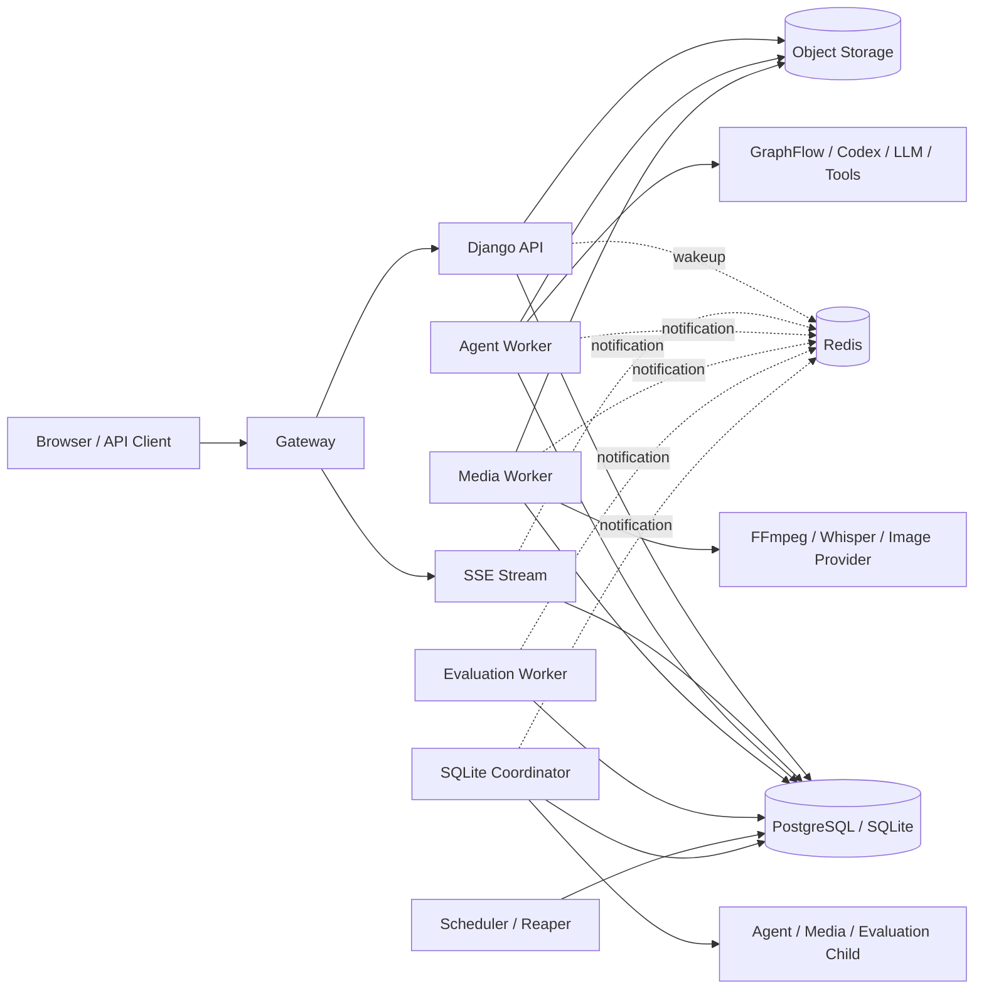
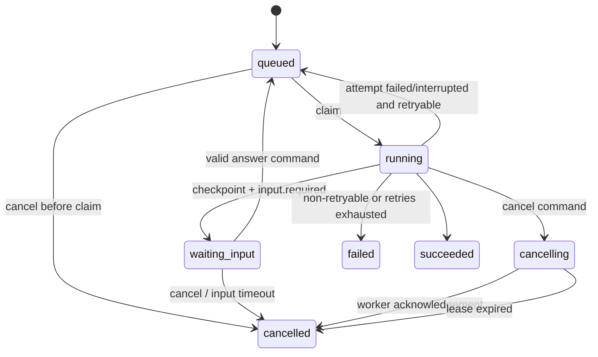

# Creation Agent Studio V2 架构设计

状态：提案（Proposed）

更新时间：2026-09-11

适用范围：`creation_agent_studio`

迁移前提：允许破坏性重构，不兼容 V1 数据库、API 和前端

Application、Agent、Skill 与 Workflow 的版本和绑定规则见
[APPLICATION_AND_WORKFLOW_V2.md](APPLICATION_AND_WORKFLOW_V2.md)。

## 1. 架构决策

V2 采用 **模块化单体控制面 + 独立执行平面 + 不可变能力版本 + 持久化运行日志**。

1. Django API 是无状态控制面，只处理鉴权、查询、命令和事务，不执行 Agent，
   不启动业务线程，也不保存进程内会话。
2. Agent、Application、Workflow 和 Evaluation 都创建统一的 `Run`；实际执行由
   Agent Worker 或 Media Worker 完成。
3. 配置的关系数据库（PostgreSQL 或 SQLite）是任务、租约、命令、事件和业务对象的
   唯一事实来源。Redis 只用于唤醒和实时通知；Redis 全部数据丢失不影响正确性。
4. 可执行配置必须引用不可变 Revision。Run 创建后，其 Agent、Application、Skill、
   Workflow、模型和策略配置不能被后续编辑改变。
5. `Run` 表示用户可见任务，`RunAttempt` 表示一次可失败、可中断的执行尝试。
   Lease 属于 Attempt，并以 fencing token 阻止过期 Worker 继续写入。
6. 浏览器只消费 `/api/v2/` REST API 和统一 SSE Run Stream。前端服务端状态由
   TanStack Query 管理，Zustand 只保存纯 UI 状态。
7. V2 使用全新数据库基线和一次性整体切换，不维持 V1/V2 双写或运行时兼容层。

不采用微服务拆分。业务模块共享一个 Django 代码库和同一个关系数据库，但通过
导入规则、数据所有权和事务入口保持边界。执行进程因资源隔离和故障恢复独立部署。

## 2. 目标与非目标

### 2.1 目标

- API 可水平扩容，无粘性会话要求。
- 页面刷新、网络断开和 Redis 故障后，可按事件序号恢复 Run 输出。
- Worker 暂停或失联后不会出现两个有效执行者同时提交结果。
- 重试始终使用原始不可变配置；每个结果可以追溯到完整 Revision 集合。
- 人机问答不长期占用 Worker；服务重启后仍能回答并继续。
- 所有数据库模式使用同一租户查询边界；PostgreSQL 集群模式额外使用 RLS。
- Agent、媒体和评测工作负载可独立扩容。
- 前后端契约由 OpenAPI 和 RunEvent JSON Schema 自动生成并在 CI 校验。

### 2.2 非目标

- 不保证任意外部工具调用 exactly-once；系统提供 at-least-once 执行和幂等键。
- 不在 V2 首版拆数据库或引入分布式事务。
- 不保留 V1 API、旧 Django migration 链或旧业务数据的在线兼容性。
- 不允许缺少持久化 checkpoint 的 Agent 进入交互等待模式。
- 不用 Redis、内存队列或 WebSocket 连接承载持久业务状态。
- 不让 SQLite 承担多主机部署、水平扩容或高并发 Worker 调度。

### 2.3 数据库支持矩阵

V2 正式支持两个部署 Profile。业务模型、API、状态机、幂等、checkpoint 和事件恢复语义一致，
但运行容量和数据库保护能力不同。

| 能力 | SQLite Local | PostgreSQL Cluster |
| --- | --- | --- |
| 适用场景 | 本地开发、桌面部署、单机小团队 | 生产集群和高并发 |
| API/SSE | 单实例 | 多实例水平扩容 |
| 执行调度 | 单个 Coordinator + 子进程池 | 多个独立 Worker |
| 同时写入 | SQLite 单写者串行化 | 行级并发写入 |
| Claim | `BEGIN IMMEDIATE` + 条件更新 | `FOR UPDATE SKIP LOCKED` |
| 租户保护 | application scoped repository | repository + PostgreSQL RLS |
| 事件存储 | 单表、批量清理 | 月分区、分区清理 |
| Redis | 可选 | 推荐但不承载正确性 |
| 高可用/PITR | 不支持 | 支持 |

SQLite 最低版本为 3.35，并要求 JSON1。启动时必须启用：

```text
PRAGMA journal_mode=WAL;
PRAGMA foreign_keys=ON;
PRAGMA busy_timeout=5000;
PRAGMA synchronous=FULL;       # 可由明确的 durability 配置降为 NORMAL
```

SQLite 数据库文件必须位于本机磁盘，禁止放在 NFS、SMB 或同步盘。SQLite Local 只允许一个
Execution Coordinator；它负责 claim、Lease、事件和 Artifact 元数据写入，并把计算任务交给
受控 Agent/Media/Evaluation 子进程。子进程通过 IPC 返回事件，不直接连接 SQLite。
Coordinator 启动时必须对数据库文件旁的固定 lock file 获取 OS 级独占锁；获取失败立即退出，
不能退化为两个 Coordinator 竞争 SQLite。

API 仍可并发写短事务，例如创建 Run 或 Command。所有 SQLite 写操作必须设置 busy timeout、
保持事务短小并对 `SQLITE_BUSY` 做有界重试。备份使用 SQLite Backup API 或 `VACUUM INTO`，
不得直接复制正在写入的 `.sqlite3` 文件。

数据库差异封装在 `execution.infrastructure.claim_strategy` 和 migration feature 中，domain 与
application 层不得按数据库 vendor 分支。CI 必须在 SQLite 和 PostgreSQL 上运行同一套状态机、
幂等、checkpoint、事件和租户测试；集群并发、RLS 和分区测试只在 PostgreSQL 上运行。

## 3. 系统拓扑



| 进程 | 负责 | 禁止 |
| --- | --- | --- |
| Gateway | TLS、同源代理、静态资源、请求大小限制 | 业务鉴权和任务状态 |
| Django API | REST、SSE、鉴权、租户上下文、事务、创建 Run/Command | Agent session、媒体执行、daemon thread |
| Agent Worker / Child | Agent adapter、工具、checkpoint、人机交互恢复 | 对外业务 API |
| Media Worker / Child | 转录、图像、视频等资源任务 | 在 API 进程内执行 |
| Evaluation Worker / Child | 数据集评测、评分和发布门禁 | 修改 Revision 内容 |
| Scheduler / Coordinator | 计算触发器、创建 Run、回收过期 Lease | 在 API 进程执行用户任务 |

SSE 可与 API 同进程部署，但在代码中是独立 application service；流连接不持有
Agent runtime。生产可按连接数将其拆成同镜像的独立进程。

## 4. 后端模块边界

### 4.1 模块及数据所有权

| 模块 | 拥有的数据 | 公开用例 |
| --- | --- | --- |
| `identity` | User、ExternalIdentity、ApiCredential | 登录、外部身份、API 凭据 |
| `tenancy` | Organization、Membership、RoleBinding | 租户选择、成员和 RBAC |
| `catalog` | Agent/Application/Skill 及 Revision、Deployment | 编辑、发布、部署、解析可执行能力 |
| `workspace` | Project、Asset | 项目、素材、产物引用 |
| `conversation` | Conversation、Turn、Message | 历史、创建 Turn、保存最终消息 |
| `workflow` | Workflow、WorkflowRevision、WorkflowRun、StepRun | DAG 编辑、发布与编排 |
| `execution` | Run、RunAttempt、RunLease、RunCommand、RunEvent、RunArtifact | 排队、领取、恢复、取消、事件流 |
| `knowledge` | KnowledgeBase、Document、Chunk、IndexRevision | 导入、索引和检索 |
| `policy` | ProviderConfig、SecretReference、PolicyRevision、QuotaPolicyRevision | 执行前授权、密钥解析、额度 |
| `evaluation` | Suite、Case、EvaluationRun、Score | 评测和发布门禁 |
| `automation` | Trigger、ScheduleCursor | 到期判断并创建 Run |
| `marketplace` | Review、Comment、Favorite、RankingProjection | 市场互动与发现投影 |
| `observability` | AuditLog、UsageRecord、Trace、TraceSpan | 审计、成本和追踪查询 |

`marketplace` 不拥有 Agent、Application、Workflow 或 ProjectBlueprint 本体；只引用其稳定对象 ID。
`automation` 不执行任务；它解析已部署 Revision 后调用 `execution.start_run`。

### 4.2 模块结构

```text
backend/modules/<module>/
├── api/
│   ├── urls.py
│   ├── serializers.py
│   └── views.py
├── application/
│   ├── commands.py
│   ├── queries.py
│   ├── dto.py
│   └── public.py
├── domain/
│   ├── entities.py
│   ├── policies.py
│   └── events.py
├── infrastructure/
│   ├── models.py
│   ├── repositories.py
│   └── adapters.py
└── tests/
```

依赖方向固定为：

```text
api -> application -> domain
infrastructure -> application ports / domain
composition root -> all modules
```

- 只有 application command 可以改变状态并定义事务边界。
- 跨模块写入只能调用对方 `application.public`，不能导入对方 model、serializer 或 view。
- 跨模块读允许专用 query service，但必须声明拥有者且不得返回可被调用方修改的 ORM 对象。
- `core` 仅保留 ID、时钟、错误、日志上下文、数据库事务辅助等无业务语义能力。
- CI 使用 import-linter 或等价规则验证依赖方向。

## 5. 不可变能力模型

稳定对象保存身份，Revision 保存可执行内容，Deployment 保存环境当前指针：

```text
Agent ──< AgentRevision <── AgentDeployment
Skill ──< SkillRevision
Application ──< ApplicationRevision <── ApplicationDeployment
Workflow ──< WorkflowRevision <── WorkflowDeployment
```

- Draft 是可变编辑区；发布操作在单个事务中校验 Draft、生成不可变 Revision 和 hash。
- 发布后的 Revision 及其子绑定禁止 UPDATE/DELETE，只能创建新 Revision。
- Deployment 原子指向一个 Revision；回滚只是切换指针。
- 创建 Run 时先解析 Deployment，再把所有 Revision ID、内容 hash、Provider 配置版本和
  Policy 版本写入 `definition_snapshot`。
- Conversation 可以跟随 Deployment，但每个 Turn 单独固定实际 Revision。
- WorkflowRevision 的每个 Step 固定 ApplicationRevision；应用升级需要发布新的 WorkflowRevision。

## 6. 统一执行模型

```text
Business object (Turn / ApplicationJob / WorkflowStepRun / EvaluationRun)
                              │
                              └──1:1── Run
                                         ├──< RunAttempt ──0..1── RunLease
                                         ├──< RunCommand
                                         ├──< RunEvent
                                         └──< RunArtifact
```

### 6.1 Run

`Run` 是用户可见的当前投影，不是追加写日志：

- `id`, `organization_id`, `owner_id`
- `executor_kind: agent | media | workflow | evaluation`、服务端注册的 `executor_key`
- `source_type`, `source_id`
- `status`, `priority`, `attempt_count`, `max_attempts`, `version`
- `definition_snapshot`, `input`, `output_summary`
- `current_attempt_id`, `next_event_sequence`
- `pending_input_request_id`, `pending_input_kind`, `pending_input_expires_at`
- `created_at`, `started_at`, `finished_at`
- `error_code`, `error_message`

`executor_kind` 表示调度到哪个执行池；`source_type` 表示业务来源，例如
`conversation_turn | application | workflow_step | evaluation_case | automation_trigger`。自动化是
来源而不是执行类型，因此它启动的 Agent 仍进入 Agent Worker 队列。

### 6.2 RunAttempt 与 Lease

`RunAttempt`：

- `id`, `run_id`, `attempt_no`
- `status: claimed | running | suspended | succeeded | failed | interrupted | cancelled`
- `worker_pool`
- `checkpoint_artifact_id`
- `started_at`, `finished_at`, `error_code`

`RunLease`：

- `attempt_id`，与 RunAttempt 一对一
- `worker_id`
- `lease_token: UUID`, `lease_epoch: bigint`
- `acquired_at`, `heartbeat_at`, `expires_at`

约束：

- `(run_id, attempt_no)` 唯一。
- 一个 Run 最多一个未结束 Attempt。
- `attempt_count` 是历史 Attempt 的单调编号；`max_attempts` 限制失败/中断预算，因人工输入而
  `suspended` 的 Attempt 不消耗失败重试预算。
- PostgreSQL Worker 通过 `SELECT ... FOR UPDATE SKIP LOCKED` 领取；SQLite Coordinator 通过
  `BEGIN IMMEDIATE` 和带状态条件的 UPDATE 领取。两者都在一个事务内递增 attempt 和 lease epoch。
- heartbeat、状态、事件、checkpoint 和 artifact 写入必须同时匹配
  `run.current_attempt_id + lease.attempt_id + lease_token + lease_epoch`。
- Reaper 使 Lease 过期后，旧 token 永久失效；恢复执行的旧 Worker 写入返回 fencing error。
- 外部副作用使用 `{run_id}:{attempt_no}:{step_key}` 作为幂等键。不能幂等的步骤必须声明
  `retry_safe=false`，中断后进入人工处理而不是自动重试。

### 6.3 Run 状态机



`succeeded`、`failed`、`cancelled` 是唯一终态，没有出边。Attempt 失败不等于 Run 失败：
只有不再重试时才把 Run 置为 `failed`。

进入 `waiting_input` 前，Adapter 必须在同一业务操作中：

1. 写入可恢复 checkpoint artifact；
2. 创建带 `input_request_id` 和过期时间的 `input.required` 事件；
3. 将 Attempt 标为 `suspended` 并释放 Lease；
4. 将 Run 标为 `waiting_input`。

回答命令必须引用当前 `input_request_id`。命令被接受后 Run 回到 `queued`，新 Attempt 从
checkpoint 恢复。没有 durable checkpoint 的 Adapter 不能发出 `input.required`。

### 6.4 原子状态与事件

所有 Run 状态变化通过 `execution.append_event_and_transition()` 完成：

1. 通过数据库策略锁定 Run：PostgreSQL 使用行锁，SQLite 使用短 `BEGIN IMMEDIATE` 写事务；
2. 校验状态转换、乐观 `version` 和可选 lease fencing token；
3. 递增 `next_event_sequence`；
4. 写 RunEvent，并更新 Run 当前投影；
5. 同一事务提交；
6. `on_commit` 向 Redis 发布 `{run_id, sequence}`，失败只影响延迟。

因此 `(run_id, sequence)` 唯一、连续且由数据库串行分配。RunEvent、AuditLog 和
UsageRecord 追加写；Run 本身是可更新的当前投影。

## 7. 命令与幂等

`RunCommand` 至少包含：

- `id`, `run_id`, `type: answer | grant_permission | deny_permission | cancel`
- `input_request_id`, `expected_run_version`, `payload`
- `created_by`, `created_at`, `consumed_at`, `result`
- `idempotency_key`, `request_fingerprint`

所有外部写请求使用 `IdempotencyRecord`，唯一键为：

```text
(organization_id, actor_id, operation, idempotency_key)
```

记录请求 hash、处理状态、响应状态码和响应体，默认保留 24 小时。同一 key 使用不同 payload
返回 `409 idempotency_key_reused`。命令状态变化与对应 RunEvent 在同一事务提交。

## 8. API V2

V2 只暴露 `/api/v2/`，不保留 V1 路由。租户业务资源统一位于：

```text
/api/v2/organizations/{organization_id}/...
```

核心接口：

```text
GET  /api/v2/organizations/{org}/applications
POST /api/v2/organizations/{org}/applications
GET  /api/v2/organizations/{org}/applications/{application}/draft
PUT  /api/v2/organizations/{org}/applications/{application}/draft
GET  /api/v2/organizations/{org}/applications/{application}/revisions
POST /api/v2/organizations/{org}/applications/{application}/revisions
GET  /api/v2/organizations/{org}/applications/{application}/deployments/{environment}
PUT  /api/v2/organizations/{org}/applications/{application}/deployments/{environment}
POST /api/v2/organizations/{org}/applications/{application}/deployments/{environment}/rollback
GET  /api/v2/organizations/{org}/applications/{application}/runtime?environment=...

POST /api/v2/organizations/{org}/conversations/{conversation}/turns
POST /api/v2/organizations/{org}/applications/{application}/runs
POST /api/v2/organizations/{org}/workflows/{workflow}/runs

GET  /api/v2/organizations/{org}/runs/{run}
GET  /api/v2/organizations/{org}/runs/{run}/events?after={sequence}&limit=...
GET  /api/v2/organizations/{org}/runs/{run}/stream
POST /api/v2/organizations/{org}/runs/{run}/commands
```

- 创建异步工作返回 `202 Accepted`、Run 资源和 stream URL。
- Draft 更新、Deployment 切换和回滚都必须携带 `expected_version`；冲突返回 `409`。
- Application Draft 可保存不完整设计，但发布边界强制校验 definition schema；生产部署要求 Admin。
- 错误统一使用 `application/problem+json`，包含稳定 `type/code`、`request_id` 和字段错误。
- 列表统一 cursor pagination；时间使用 UTC RFC 3339；ID 使用 UUID。
- OpenAPI 3.1 是 REST 契约源；RunEvent payload 由独立 JSON Schema 管理。
- CI 生成 TypeScript client，生成后工作区必须无 diff。

浏览器采用同源 Django session：`HttpOnly + Secure + SameSite=Lax` Cookie，所有 unsafe
请求使用 Django CSRF token。外部客户端使用短期 OIDC JWT 或 scoped API credential。
SSE 使用同源 Cookie；每次连接和数据库补拉都重新校验 organization membership 和 Run 权限。

## 9. RunEvent 与 SSE

### 9.1 稳定事件

- 生命周期：`run.queued`、`run.started`、`run.waiting_input`、`run.cancelling`、
  `run.retry_scheduled`、`run.succeeded`、`run.failed`、`run.cancelled`
- Attempt：`attempt.started`、`attempt.interrupted`、`attempt.failed`
- 输出：`output.delta`、`output.snapshot`
- 工具：`tool.started`、`tool.completed`、`tool.failed`
- 交互：`input.required`、`input.accepted`、`input.expired`
- 产物：`artifact.created`
- 进度：`progress.updated`

事件信封：

```json
{
  "schema_version": 1,
  "run_id": "uuid",
  "attempt_id": "uuid-or-null",
  "sequence": 42,
  "type": "output.delta",
  "payload": {"text": "..."},
  "created_at": "2026-09-11T10:00:00Z"
}
```

### 9.2 无缝重放算法

SSE 端点不能使用“先重放、后订阅”。正确流程是：

1. 鉴权，并解析 `Last-Event-ID` 或 `after`；
2. 先订阅 Redis run channel；
3. 在事实数据库读取当前 high-water sequence；
4. 从客户端 cursor 重放到 high-water；
5. 排空订阅期间通知，并按 sequence 从数据库取真实事件；
6. 连接存活期间每 500 ms 做一次数据库 catch-up，Redis 只触发提前查询；
7. 每 15 秒发送 SSE comment heartbeat；慢客户端超出缓冲上限时断开并让其重连。

这消除了“数据库重放与 Redis 订阅之间”的丢事件窗口，也保证 Redis 中断时仍能交付事件。

### 9.3 客户端归并

Reducer 维护 `nextSequence` 和乱序缓冲：

- `sequence < nextSequence`：重复事件，忽略；
- `sequence == nextSequence`：应用，并连续排空缓冲；
- `sequence > nextSequence`：缓存并调用 events API 补洞；
- `output.snapshot.through_sequence` 可替换此前输出投影；delta 只能按连续序号应用。

Worker 将 token delta 按最多 50 ms 或 4 KiB 合并后持久化。每 200 个输出事件生成 snapshot。
PostgreSQL 的 RunEvent 按月分区；SQLite 使用单表和有界批量 DELETE，并在文件超过配置阈值时
告警。两种模式默认保留 30 天；Run 的最终 snapshot 和 Artifact 按租户策略保留。
cursor 早于保留水位时 events API 返回 `410 event_history_compacted` 和 snapshot URL，客户端重置。

当前实现以 `RunEventSnapshot` 保存与前端 reducer 同构的最新投影。`compact_run_events` 只处理
终态 Run，每次对单个 Run 最多删除一个有界批次；活跃 Run 不会被后台保留任务压缩。
Artifact API 仅返回元数据，访问内容前先签发短期 URL。本地后端使用 HMAC token 并在打开文件前
校验解析路径位于 `ARTIFACT_ROOT`；对象存储可配置服务端 URL factory 返回云厂商签名 URL。

## 10. Worker 与 Adapter 契约

Worker 主循环只做 claim、启动受控子进程、heartbeat、命令轮询和结果提交。每个 Run 在独立
子进程或容器执行，父进程可在取消宽限期后强制终止。

```text
ExecutionAdapter
├── validate(definition_snapshot, input)
├── start(context) -> events / result / checkpoint
├── resume(context, checkpoint, command) -> events / result / checkpoint
├── cancel(context)
└── classify_error(error) -> retryable / terminal / manual
```

- Adapter 不访问 Django request、serializer 或前端协议。
- secret 只在 Worker 内按 SecretReference 解析，绝不进入 Run input、event 或日志。
- 工具调用前重新执行 Policy 和 Quota 检查，不能只信任 Run 创建时的结果。
- Worker/Coordinator 无任务时以事实数据库轮询为兜底，Redis wakeup 仅减少 claim 延迟。
- Agent、Media、Evaluation 使用独立 worker pool 和并发额度。

## 11. Workflow 执行

Workflow 是不可变 DAG Revision。编排器本身是 execution application service，不持有长进程：

1. 创建 WorkflowRun 和根 Run；
2. 为依赖满足的 Step 创建子 Run；
3. 子 Run 终态事件通过 transactional outbox 唤醒编排器；
4. 编排事务锁定 WorkflowRun，幂等推进 DAG；
5. Step 输出只通过 Artifact 或已验证的结构化 output 传给下游；
6. 失败策略由 WorkflowRevision 固化：`fail_fast | continue | compensate`。

每个 StepRun 固定 ApplicationRevision、输入映射、重试策略和超时。补偿也是显式 Step，
系统不声称自动回滚外部副作用。

## 12. 前端架构

```text
frontend/src/
├── app/                 # router、providers、bootstrap
├── pages/               # 页面编排
├── widgets/             # ChatPanel、WorkflowCanvas、ProjectSidebar
├── features/            # start-run、answer-input、cancel-run、publish-revision
├── entities/            # run、conversation、application、workflow、project
└── shared/              # generated API、SSE、auth、ui、lib、config
```

依赖方向：`app/pages -> widgets -> features -> entities -> shared`。

| 状态 | 所有者 |
| --- | --- |
| REST 服务端状态 | TanStack Query |
| Run 流式投影 | `entities/run/eventReducer` + Query cache |
| organization/project/filter | URL |
| theme/sidebar 等 UI | 小型 Zustand store |
| composer/form | 组件或表单库 |

SSE transport 只负责连接、cursor、重连和事件信封校验；业务 reducer 不访问网络。
任何 feature 都不能直接修改另一 feature 的 store。错误由 feature boundary 呈现，HTTP client
不显示 toast。

## 13. 数据、安全与租户隔离

- 所有租户业务表包含非空 `organization_id`；跨表关系通过约束保证同租户。
- 两种数据库均强制使用 organization-scoped repository/application service，任何 API query
  都不能直接使用未限定租户的 manager。
- PostgreSQL Cluster 的 API 数据库角色额外启用 RLS，请求事务使用
  `SET LOCAL app.organization_id`；SSE 每次补拉使用独立短事务，不为连接生命周期持有事务。
- RLS policy 由 migration 安装到所有 V2 直接租户表，并通过 `Run` 关联约束 Attempt/Lease；API
  与跨租户 Worker 必须使用不同数据库角色，后者才允许 `BYPASSRLS`。
- PostgreSQL Worker 使用独立数据库角色领取跨租户任务；SQLite Coordinator 在领取后同样从
  Run 推导 organization。两者的执行写入都必须校验 run organization。
- Provider 凭据只保存 SecretReference；引用环境变量、Vault 或云 Secret Manager。
- Asset/Artifact 只保存 object key、hash、MIME、size、来源和访问策略。
- 上传经过 MIME sniff、大小限制、病毒扫描和 quarantine；签名 URL 短期有效。
- 本地目录访问只能由部署明确启用的 Local Connector 完成，并校验解析后的真实路径位于
  organization allowlist 根目录内。
- AuditLog 记录 actor、organization、action、resource、request_id、run_id 和结果，
  不记录 token、secret、完整 prompt 敏感字段或文件内容。

跨模块异步副作用使用事实数据库中的 transactional outbox。消费者以 outbox event ID 幂等；
发布成功后可清理。Redis 通知无需进入 outbox，因为 SSE 和 Worker 都有数据库轮询兜底。

## 14. 可观测性与 SLO

统一关联字段：

```text
request_id, trace_id, organization_id, user_id,
run_id, attempt_id, attempt_no, worker_id,
conversation_id, project_id, revision_ids
```

最小指标：

- API：吞吐、p50/p95/p99、错误率、DB 查询时间；PostgreSQL 额外记录 RLS 拒绝数。
- Queue：按 pool 的队列深度、最老任务年龄、claim 延迟。
- Lease：heartbeat 延迟、过期数、fencing 拒绝数、zombie worker 数。
- Run：按 executor/revision/provider 的成功率、耗时、取消率、重试率、等待输入时长。
- LLM：首 token 延迟、token、成本、限流和 provider 错误。
- Stream：连接数、重连数、补洞数、事件端到端延迟、慢消费者断开数。
- Media：CPU/GPU、处理时长、产物大小和失败类别。

初始 SLO：

- 非生成 API 月可用性 99.9%，p95 < 500 ms。
- Run 创建 p95 < 800 ms。
- 启用 Redis 通知加速时，事件持久化到浏览器 p95 < 1 s；未启用或 Redis 完全不可用时
  p95 < 2 s。
- 已确认的 Run、Command 和 Event 不因任一 API、Worker 或 Redis 进程重启丢失。

## 15. 部署

### SQLite Local

```text
gateway/frontend + 单实例 api/sse + execution-coordinator
sqlite + 可选 redis + local object storage
execution-coordinator ──> agent/media/evaluation child processes
```

SQLite Local 是完整功能模式，而不是 mock：支持 Run、重试、取消、checkpoint、Workflow、
Automation 和断线重放。它不支持多 API 实例、多 Coordinator、多主机 Worker、RLS、PITR 或事件分区。
开发默认使用该 Profile，并提供一条命令和确定性 seed 启动。

### PostgreSQL Cluster

```text
gateway/frontend + api/sse replicas
agent-worker + media-worker + evaluation-worker + scheduler replicas
postgres + redis + object storage
```

- API、各 Worker、Scheduler 使用同一镜像、不同启动命令。
- API 按请求量和 SSE 连接数扩容；Worker 按 pool 队列与 CPU/GPU 扩容。
- PostgreSQL 开启备份、PITR、连接池、分区维护和慢查询监控。
- Redis 不开启业务恢复依赖；清空 Redis 是必须通过的故障演练。
- Object Storage 开启版本、生命周期和租户前缀策略。
- 一个 Release 中后端、Worker、前端和数据库 baseline 必须版本一致，不支持混跑 V1/V2。

### 数据库可移植性规则

- 核心 migration 和 model 只能使用 Django 在 SQLite/PostgreSQL 均支持的字段与约束。
- PostgreSQL RLS、分区和索引优化放在带 vendor guard 的独立 migration/启动步骤中。
- JSON 查询不能成为跨数据库核心业务规则；复杂配置先用 Pydantic 加载后验证。
- 时间、UUID、布尔值和排序规则必须通过 contract test 保证两种数据库返回一致语义。
- SQLite claim 只能由 Coordinator 专用连接执行；该连接显式开启 `BEGIN IMMEDIATE`。

## 16. 破坏性切换方案

V2 使用新的 Django app labels、表名和一条新的 initial migration 基线。旧 migration 文件归档
到 release tag，不进入 V2 运行镜像。

切换步骤：

1. 冻结 V1，创建代码 tag、数据库备份和对象存储清单；
2. 停止 V1 API、Worker、Scheduler，进入维护窗口；
3. 创建全新 PostgreSQL database/schema 或 SQLite 文件，执行同一套 V2 initial migration；
4. 如启用 Redis则清空它，并使用独立 `v2/` object key 前缀；
5. 创建管理员、组织和内置 Revision seed；
6. 同时部署 V2 API、Worker 和前端；
7. 执行 smoke、租户隔离、Run、SSE 和 Worker crash 测试后开放流量。

默认不迁移 V1 对话、Run、Workflow 和配置。若必须保留少量用户或资产，只允许通过独立的
一次性 export/import 工具导入 V2 公共 application command；不得让 V2 model 兼容读取旧表。

回滚以整个系统为单位：停止 V2、恢复 V1 代码和 V1 数据库备份。V2 产生的数据不反向写回 V1。

## 17. 实施切片

### Slice 0：契约与骨架

- 建立新模块目录、导入守卫、OpenAPI 3.1 和 ProblemDetails。
- 建立 organization-scoped repository、可选 PostgreSQL RLS、不可变 Revision 基类和发布事务。
- 建立全新 initial migration 和 seed；此阶段不兼容 V1。

退出条件：空 SQLite 和 PostgreSQL 均可一键启动；跨租户负向测试和 Revision 不可变测试通过。

### Slice 1：Execution 核心

- 实现 Run、RunAttempt、Lease fencing、Command、Event 和 Artifact。
- 实现 PostgreSQL claim strategy、SQLite Coordinator strategy、原子事件序号、reaper、
  数据库轮询和可选 Redis wakeup。
- 实现 events API、SSE 无缝重放、前端 reducer。

退出条件：两种数据库均通过 crash/replay；PostgreSQL 额外通过 zombie Worker 并发领取测试，
SQLite 额外通过 `SQLITE_BUSY` 恢复和单 Coordinator 启动锁测试。

### Slice 2：批量转录

- 将批量转录改为第一个 Media Adapter。
- 删除 Job/JobEvent/WebSocket 和 Web 进程线程实现。
- 验证取消、外部副作用幂等、进程强杀和 artifact 恢复。

退出条件：PostgreSQL 下两个 Media Worker、SQLite 下两个受控 Media 子进程均可并发计算，
且同一 Run 只有一个有效 Attempt。

### Slice 3：Agent 与人机交互

- Adapter 迁入 Agent Worker，删除进程内 session registry。
- 实现 durable checkpoint、input request、answer/permission command。
- Conversation Turn 固定 Revision snapshot。

退出条件：等待输入期间重启所有 API/Worker，回答后仍能从 checkpoint 继续。

### Slice 4：Workflow、Evaluation 与 Automation

- 发布不可变 Workflow DAG，使用子 Run 编排。
- Evaluation 固定 AgentRevision；Deployment 受评测门禁控制。
- Scheduler 只创建 Run，验证重复触发幂等。

退出条件：编排器重启和重复 outbox 投递不会重复创建 StepRun。

### Slice 5：前端切换与生产加固

- 完成 feature/entity 分层，移除业务 Zustand store 和手写 V1 client。
- 完成 Cookie/CSRF、对象存储、配额、审计、指标和告警。
- 按第 16 节整体切换，不保留 V1 页面或协议。

## 18. 架构验收标准

- PostgreSQL 下两个 API 实例随机负载均衡时，Run 的 start/answer/cancel/stream 均可用；
  SQLite 下单 API 重启后相同链路可恢复。
- Worker Lease 过期并被新 Worker 领取后，旧 Worker 的事件和终态写入被 fencing 拒绝。
- Run 重试使用与第一次 Attempt 完全相同的 Revision ID 和配置 hash。
- SSE 在 replay/subscription 竞争窗口产生事件时不丢失、不重复应用。
- Redis 清空并停止 30 秒期间，Run 可领取，事件可在 2 秒内通过数据库补拉显示。
- 等待输入期间重启 API 和 Agent Worker，回答后从 checkpoint 恢复。
- 相同幂等键和相同 payload 返回原响应；不同 payload 返回 409。
- 乱序、重复和缺口事件不会破坏输出；过期 cursor 能通过 snapshot 重置。
- 两种数据库下任意 API 用户都不能读取其他 organization 的 Run、Event、Revision 或 Artifact；
  PostgreSQL 还必须通过绕过 ORM 的 RLS 负向测试。
- Web 进程不存在业务 daemon thread、Agent session registry 或执行器。
- V2 的空 SQLite 文件和空 PostgreSQL database 均可由 initial migration + seed 确定性重建。

## 19. 已否决方案

| 方案 | 原因 |
| --- | --- |
| V1/V2 双栈和原地兼容迁移 | 已允许破坏性重构；兼容层会延长两套状态机并掩盖数据语义冲突 |
| 立即拆微服务 | 当前团队和业务边界不需要承担分布式事务与独立运维成本 |
| Run 与 Attempt 合并 | 无法清楚表达重试、Lease fencing、单次成本和中断原因 |
| 可执行对象只保留最新配置 | 排队、重试、评测和审计不可复现 |
| waiting_input 时长期占用 Worker | 人工等待不可控，扩容效率差，进程重启无法恢复 |
| 先重放数据库再订阅 Redis | 存在确定的丢通知窗口 |
| Redis 作为队列或事件事实来源 | 清空、淘汰或故障可能丢失已确认业务状态 |
| 所有实时交互使用 WebSocket | 上行命令低频；HTTP 命令 + 可重放 SSE 更简单可靠 |
| 全局 Zustand 保存服务端状态 | 使协议、缓存和 UI 生命周期耦合，难以局部演进 |
